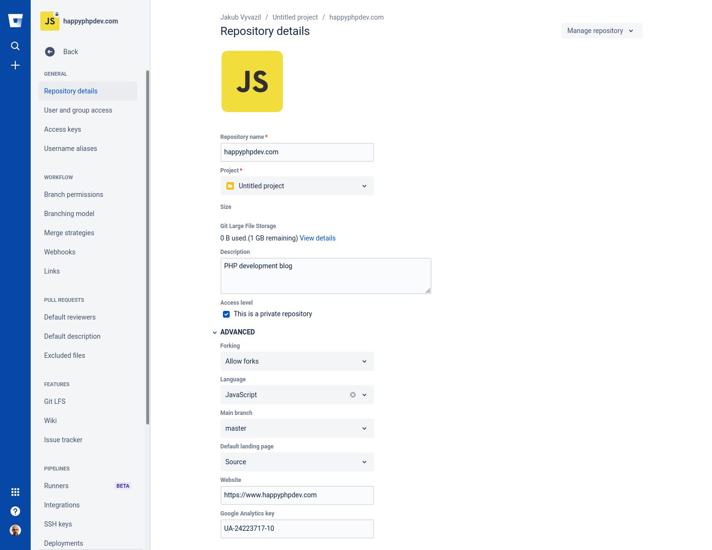

Do you want to have your main branch named to <strong>main</strong> instead of deprecated <strong>master</strong>? Not problem at all. You should check how you named your remote repo(s), it's usually called <strong>origin</strong>. You can check it:

```git
git remotes
```

And now you are ready to go:

```git
git branch -m master main
git push -u origin main
git push origin --delete master
```

<hr>

Do you see this error message?

``` bash
 ! [remote rejected] master (deletion of the current branch prohibited)
```

Alright, you have to set the main branch in your remote GIT repository.



