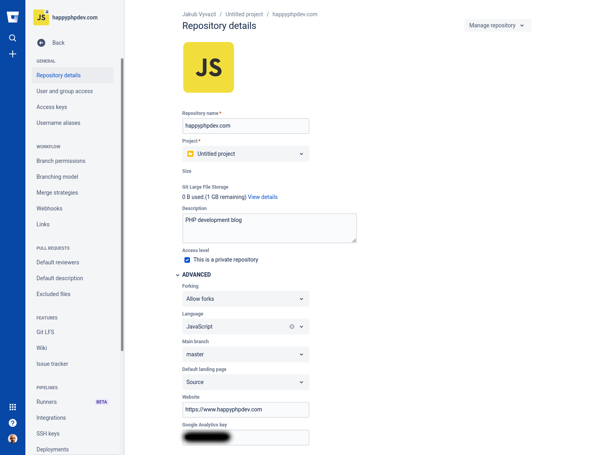

Do you want to rename your main branch from the deprecated <strong>master</strong> to <strong>main</strong>? No problem at all. First check what your remote repository is called, it's usually <strong>origin</strong>:

```bash
git remote -v
```

And now you are ready to go:

```bash
git branch -m master main
git push -u origin main
git push origin --delete master
```

<hr>

Do you see this error message?

```bash
 ! [remote rejected] master (deletion of the current branch prohibited)
```

You'll need to change the default branch in your remote Git host's settings first (Bitbucket in this example):



And don't forget to set the default branch in your local Git repository:

```bash
git config --global init.defaultBranch main
```
